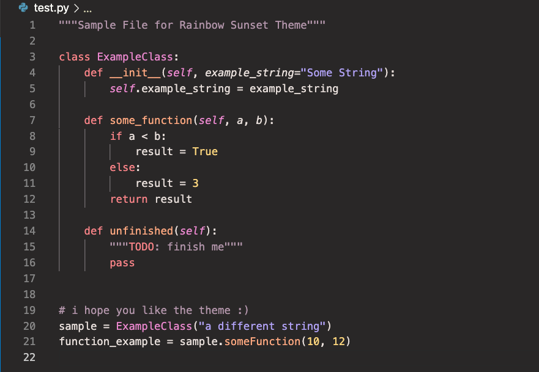

# Rainbow Sunset

Rainbow Sunset is a high contrast, dark syntax and color theme using warm, bright colors for easy differentation created for [Visual Studio Code](https://code.visualstudio.com/).

Rainbow Sunset was created with a focus in Python development. Any suggestions for improvement
are welcome!

## Color Scheme
While general colors were selected by the creator, the selection of specific hex-codes
 was aided via [coolors.co](https://coolors.co/).

Color Palletes Generated:
- [Color Elements](https://coolors.co/d03d3a-f88387-fea880-fad47c-87c999-6ca5b2-b1a2f6-e987cd)
- [Greyscale Elements](https://coolors.co/262525-292727-3b3635-6b6669-b295aa-e7dada)

## Setting
When installation completes, select "Rainbow Sunset" as your color theme (Preferences → Workbench: Color Theme → Rainbow Sunset)

## Screenshot

